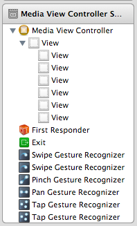

项目组织规范
========

欲达到的目的
----
保证可维护性是最优先原则。其两个重要方面是：易于理解，易于修改。

代码可能只写一次，但阅读的次数很容易达到几十上百次，大型项目更是如此，几万都不止。保证项目易于理解，能大大节约团队时间，提高效率，更何况理解是进行开发的前提。

易于修改不必多解释，需求变化是正常的，需求不变是不正常的。

组织 Scene 中的视图树
----
“视图树”这种说法不太清楚，看下面两张图：

说的是这里面视图的组织。示例中已经给视图增加命名标注了，增加标注后一目了然。如果不去命名的话，可能会像这样：

如果在 Canvas 里视图很清晰，能立即分辨各个视图那很幸运。通常你不得不挨个看一下视图是跟哪个 IBOutlet 连起来的，如果变量的命名凑巧很糟糕可能还要看看代码具体是怎么写的。更糟糕点如果视图没任何连接，连判断这个元素到底有没有用到都不那么容易。

相对以上窘境，重命名操作真是举手之劳，选中视图然后按下回车就可以了。

视图顺序是从底到顶的，在不违反该原则的前提下，尽量按照实际布局以从上到下，从左到右的顺序组织视图。

