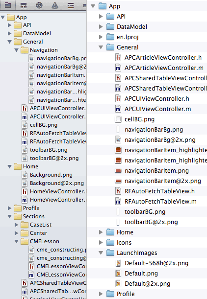
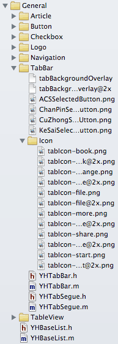
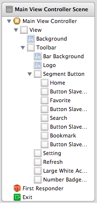

项目组织规范
========

欲达到的目的
----
保证可维护性是最优先原则。其两个重要方面是：易于理解，易于修改。

代码可能只写一次，但阅读的次数很容易达到几十上百次，大型项目更是如此，几万都不止。保证项目易于理解，能大大节约团队时间，提高效率，更何况理解是进行开发的前提。

易于修改不必多解释，需求变化是正常的，需求不变是不正常的。

资源文件组织
----
最新讨论决定，业务模块及其附属资源文件放在一起，而不是之前把图片专门放在 Resources 目录中。

下图是一个示例，右侧是实际文件摆放。通用的模块放在 General 下。

随着某个 Group 中文件逐渐增多，必要时需要进一步分组以便维护。

由于 Xcode 中 Group（黄色文件夹）与实际文件目录中的结构没有强制的关联，这样会导致项目文件中的结构与文件系统中的结构不一致。调整的话需要手工移动文件，再重新加入到 Xcode 项目文件中，比较麻烦。

折中一下，规定保持 App 目录下第一层目录要一致，再下层不强制要求，能尽量尽量吧。以上图为例就是 Article、Button 等等 Group 下的文件都必须要在 General 目录下，至于 General 底下怎么组织不强制。

组织 Scene 中的视图树
----
“视图树”这种说法不太清楚，看下面两张图：

说的是这里面视图的组织。示例中已经给视图增加命名标注了，增加标注后一目了然。如果不去命名的话，可能会像这样：

如果在 Canvas 里视图很清晰，能立即分辨各个视图那很幸运。通常你不得不挨个看一下视图是跟哪个 IBOutlet 连起来的，如果变量的命名凑巧很糟糕可能还要看看代码具体是怎么写的。更糟糕点如果视图没任何连接，连判断这个元素到底有没有用到都不那么容易。

相对以上窘境，重命名操作真是举手之劳，选中视图然后按下回车就可以了。

视图顺序是从底到顶的，在不违反该原则的前提下，尽量按照实际布局以从上到下，从左到右的顺序组织视图。

